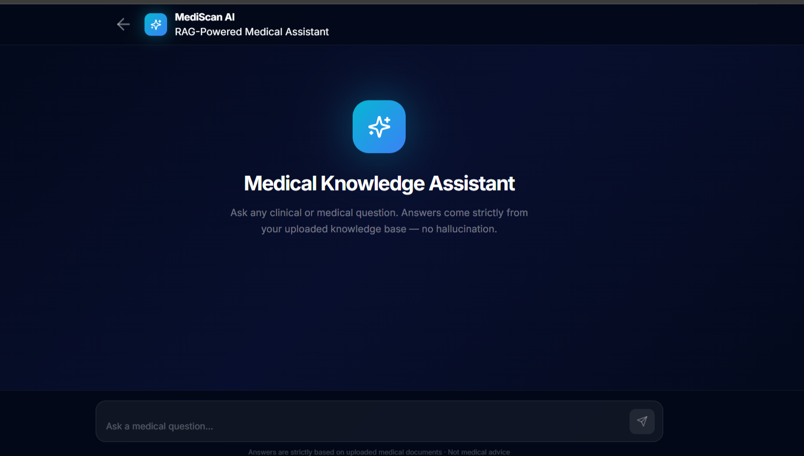
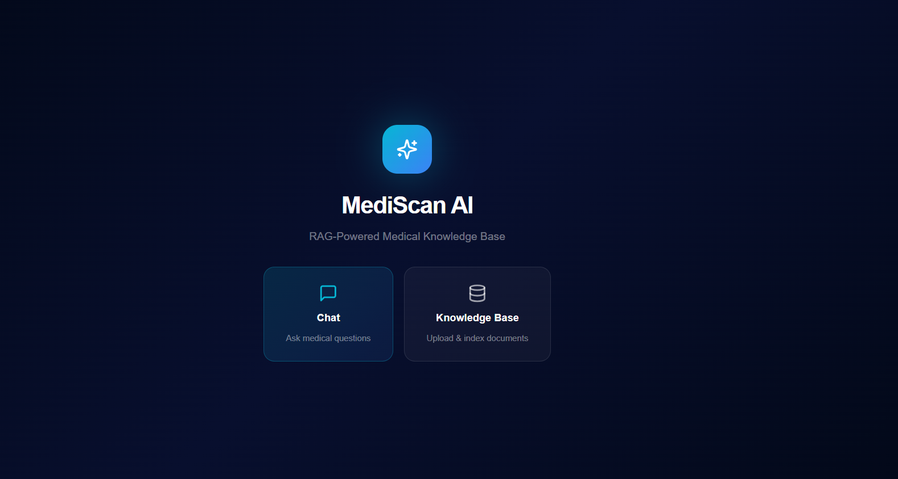
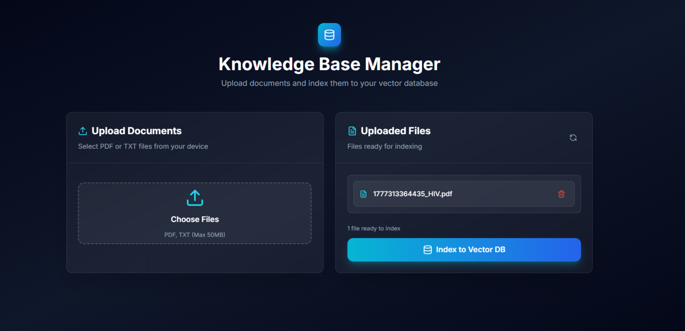

# MediScan AI - RAG-Powered Medical Knowledge Base

AI-powered medical knowledge base with document upload, vector database indexing, and intelligent chat using RAG (Retrieval-Augmented Generation).

## 📸 Screenshots

<div align="center">

### Chat Interface


### Knowledge Base Manager  


### Document Upload


</div>


##  Key Features

-  **Document Management** - Upload, validate, and manage PDF/TXT files (max 50MB)
-  **AI Chat** - RAG-powered responses with real-time streaming
-  **Vector Search** - Semantic search using Pinecone
-  **Modern UI** - Dark theme with glassmorphism effects
-  **Responsive** - Works on desktop and mobile

##  Tech Stack

Next.js 14 • TypeScript • Tailwind CSS • Pinecone • Groq • LangChain

##  Quick Start

### 1. Install Dependencies
```bash
npm install
```

### 2. Configure Environment
Create `.env` file:
```env
PINECONE_API_KEY=your_pinecone_api_key
PINECONE_INDEX_NAME=your_index_name
PINECONE_NAMESPACE=your_namespace
GROQ_API_KEY=your_groq_api_key
```

### 3. Run Development Server
```bash
npm run dev
```

Open [http://localhost:3000](http://localhost:3000)

### 4. Production Build
```bash
npm run build
npm start
```

##  Usage

### Upload Documents
1. Go to `/pinecone` page
2. Click **Choose Files** and select PDF/TXT files
3. Click **Upload** to upload files
4. Click **Index to Vector DB** to process documents

### Chat with Your Knowledge Base
1. Go to `/chat` page
2. Type your question and press Enter
3. Get AI-generated answers based on your documents

## Project Structure

```
app/
├── chat/page.tsx              # Chat interface
├── pinecone/page.tsx          # Document manager
pages/api/
├── chat.ts                    # Chat endpoint
├── upload.ts                  # File upload
├── updatedatabase.ts          # Vector indexing
├── deletefile.ts              # File deletion
└── getfilelist.ts             # File listing
```

##  Configuration

### Pinecone Setup
1. Create account at [pinecone.io](https://www.pinecone.io/)
2. Create index with matching embedding dimensions
3. Add API key and index name to `.env`

### File Upload Limits
Modify in `pages/api/upload.ts`:
```typescript
maxFileSize: 50 * 1024 * 1024, // 50MB
```

##  Troubleshooting

**Hydration Errors**
```bash
rm -rf .next && npm run dev
```

**File Upload Issues**
- Check `uploads` folder permissions
- Verify file types are `.pdf` or `.txt`
- Ensure files are under 50MB

**Vector Database Errors**
- Verify Pinecone API key and index name
- Check index dimensions match embedding model


## 📝 License

MIT License

---

Built with ❤️ using Next.js and AI
